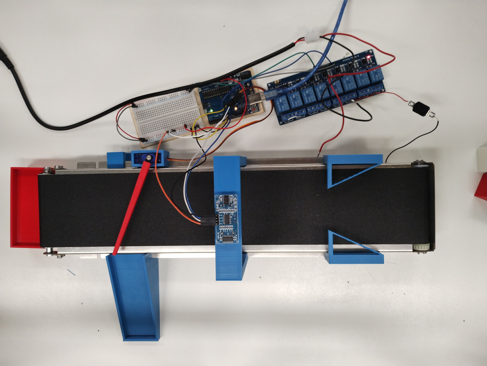

# Sorteermachine
Dit is een sorteermachine die blokjes gaat sorteren op basis van grootte. 

#### Hardware:
- Arduino Uno
- Ultrasonensensor
- Relais breakout module
- Servo
- Loopband

#### Software
- Arduino IDE

## How to use

### Loopband:
De loopband word aansgestuurd op digitale pin 8 (D8). Hierdoor kunnen we de loopband aan en uit zetten maar dit word nog niet gebruikt. Hiermee schakelen we de relais die die loopband(24V) zal aansturen.
Op dit moment word het manueel bestuurd met een knop.

### Ultrasonensensor
De ultrasonensensor zal de grootte van blokjes meten en vervolgens een signaal sturen naar de servo. Dit is mogelijk door en op maat gemaakt 3D geprinte houder die boven de loopband staat waardoor de sensor vast staat.

Als het een groot blokje is stuurt het een signaal waardoor die het blokje doorlaat. Bij een klein blokje gaat de servo niets doen en zal het zo in een afzonderlijk bakje schuiven.

Aansluiting:
- VCC op 5V
- GND op GND
- Echo op D12
- Trig op D10

https://projecthub.arduino.cc/Isaac100/getting-started-with-the-hc-sr04-ultrasonic-sensor-7cabe1 

### Servomotor
De arduino bestuurd de servo op basis van de input van de ultrasonesensor. Zo draait de servo 60 graden bij een signaal (hiervoor gebruiken we de servo library van Arduino) en anders niet.

Aansluiting:
- GND op GND
- +5V op 5V
- DATA op D9
https://training.funmetelectronica.nl/docs/arduino-basis/lessen/les-8-servo-met-pot/ 

